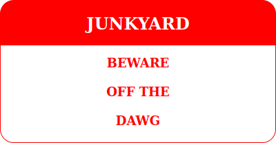
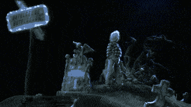

What i've used:<br>
sudo apt install ffmpeg gifsicle

```bash
ffmpeg -ss 23.0 -t 1.8 -i Beetlejuice.1988.German.1080p.microHD.x264-RAIST.mkv -vf "palettegen=max_colors=16:reserve_transparent=0" palette.pn
ffmpeg -ss 3023.0 -t 4.0 -i Beetlejuice.1988.German.1080p.microHD.x264-RAIST.mkv -i palette.png -filter_complex "[0:v] fps=10,scale=320:-1 [new];[new][1:v] paletteuse" output_trimmed_enhanced_reduced.gif
gifsicle -O3 --lossy=100 output_trimmed_enhanced_reduced.gif -o output_gifsicle.gif
