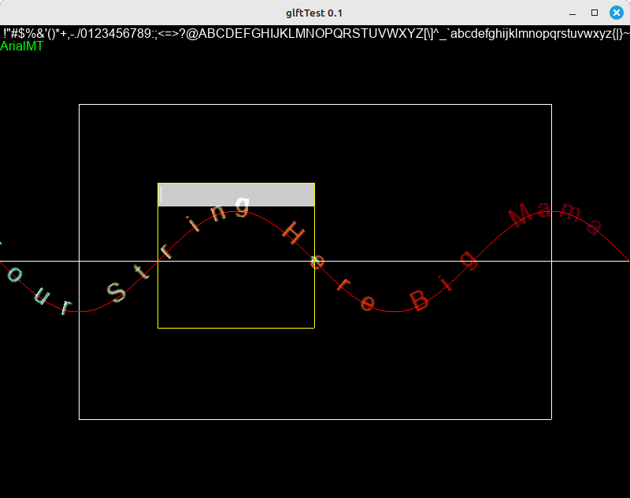

# OpenGL FreeType Text Rendering



Dieses Projekt implementiert eine einfache Textrendering-Funktion für OpenGL mithilfe von FreeType und GLFW.

## Funktionalitäten

- Laden und Rendern von Text mit TrueType-Schriftarten.
- Unterstützung von individuellen Schriftarten und -größen.
- Einfache Integration in OpenGL-Anwendungen.

## Prerequisites

Um dieses Projekt zu verwenden, müssen Sie die folgenden Bibliotheken installiert haben:

- GLFW (OpenGL Fenster- und Eingabebibliothek)
- FreeType (Bibliothek für die Verarbeitung von Schriftarten)

## Installation unter Linux

1. Installieren Sie GLFW:
   ```bash
   sudo apt-get install libglfw3 libglfw3-dev
   sudo apt-get install libfreetype6 libfreetype6-dev

